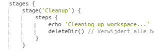
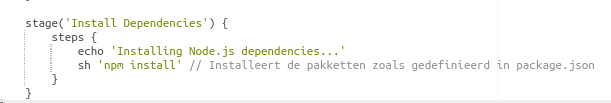
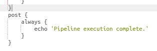
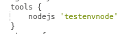
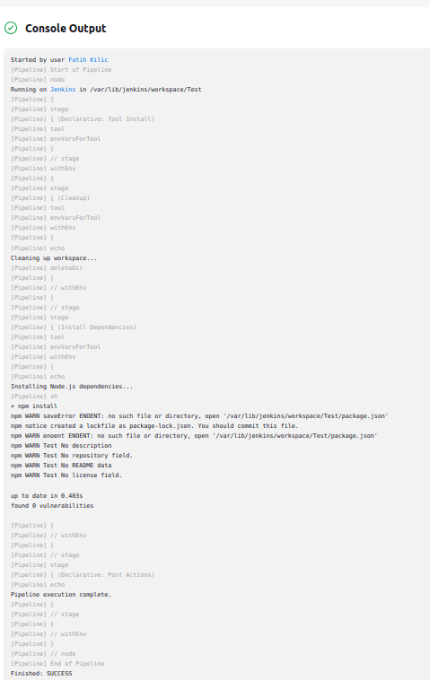

### test.jenkinsfile

### Cleanup Stage
Dit beeld toont de stage voor het opruimen van de workspace.

### Dependencies Installation
Dit beeld toont de installatie van de benodigde Node.js dependencies.

### Post Stage
Dit beeld toont de post-verwerking die wordt uitgevoerd na de pipeline.

### Tools Stage
Dit beeld toont de installatie van de gebruikte tools in de pipeline.

### Console Output
Dit beeld toont de console-uitvoer van de jenkinsfile

a)

b)
